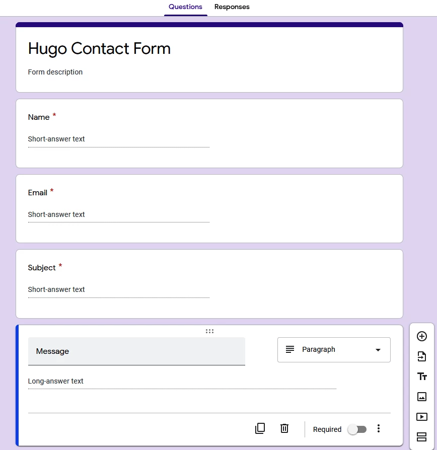
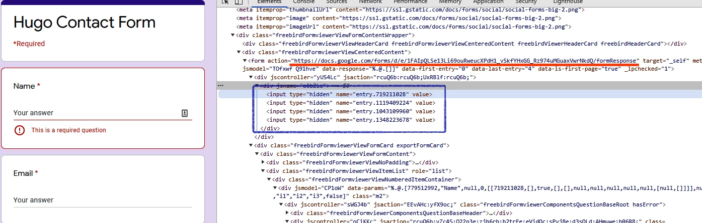
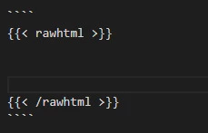
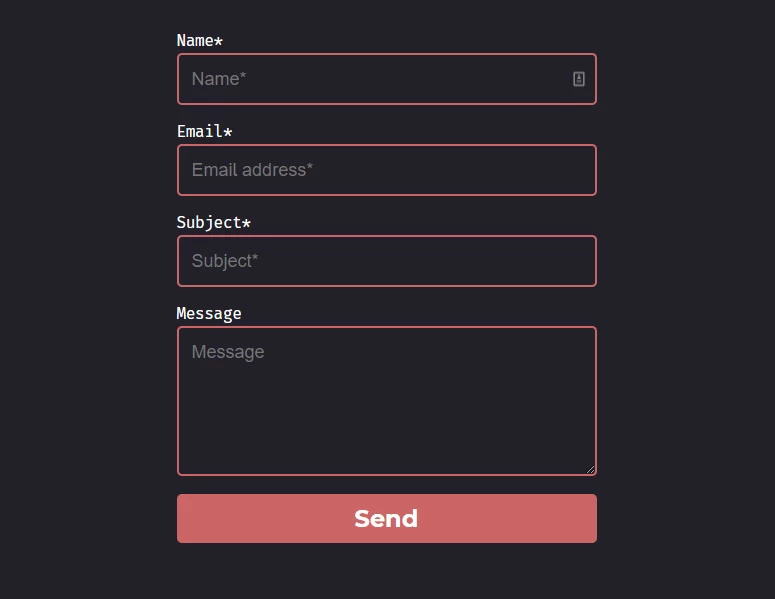
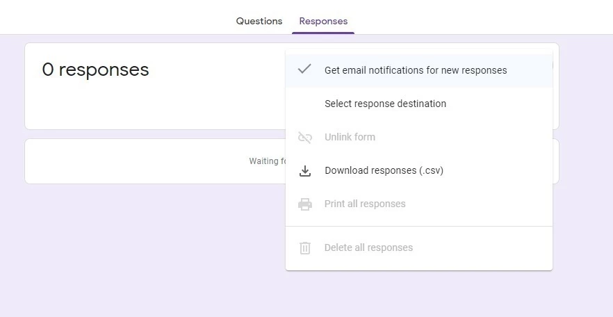

First open [Google form](https://www.google.com/forms/about/) and create a form with Name, Email, Subject and Message.




Now create new page with following

```
hugo new contact.md
```

To fill the google form from our site you need form id and field ids. Now open the form in incognito mode to get the field ids and make a note of them.



if you don’t have `Raw HTML` layout for your site, HTML content may not render properly. If you’ve *rawhtml* layout, you can skip this step. To add rawhtml layout create `rawhtml.html` file in your theme directory `layouts > shortcodes > rawhtml.html`. Add fallowing code to the file, save and exit.

```
<!-- raw html -->
{{.Inner}}
```

Add *rawhtml* tag in `contact.md`



Now add following to your contact.md file and replace the form ID and field IDs from previous.

```
<script type="text/javascript">var submitted=false;</script>
<iframe name="hidden_iframe" id="hidden_iframe" style="display:none;" 
onload="if(submitted) {document.getElementById('formSubmited').innerHTML = 'Thanks for filling out our form!' }"></iframe>

<form accept-charset="UTF-8" action="https://docs.google.com/forms/u/0/d/e/<formID>/formResponse" method="POST" target="hidden_iframe" onsubmit="submitted=true">

  <label>Name*</label>
        <input type="text" placeholder="Name*" class="form-input" name="entry.719211028" required>

  <label>Email*</label>
        <input type="email" placeholder="Email address*" class="form-input" name="entry.1119409224" required>

   <label>Subject*</label>
        <input type="text" placeholder="Subject*" class="form-input" name="entry.1043109960" required>

   <label>Message</label>
        <textarea rows="5" placeholder="Message" class="form-input" name="entry.1348223678" ></textarea>

   <button type="submit">Send</button>

   <p id="formSubmited"></p>
</form>
```
**Replace FormID with actual ID from Google form**

Create `form.css` file inside `static > CSS` directory and add following to it.

```
@import url(https://fonts.googleapis.com/css?family=Montserrat:400,700);

form { max-width:420px; margin:50px auto; }

.form-input {
color:white;
font-family: Helvetica, Arial, sans-serif;
font-weight:500;
font-size: 18px;
border-radius: 5px;
line-height: 22px;
background-color: transparent;
border:2px solid #CC6666;
transition: all 0.3s;
padding: 13px;
margin-bottom: 15px;
width:100%;
box-sizing: border-box;
outline:0;
}

.form-input:focus { border:2px solid #CC4949; }

textarea {
height: 150px;
line-height: 150%;
resize:vertical;
}

[type="submit"] {
font-family: 'Montserrat', Arial, Helvetica, sans-serif;
width: 100%;
background:#CC6666;
border-radius:5px;
border:0;
cursor:pointer;
color:white;
font-size:24px;
padding-top:10px;
padding-bottom:10px;
transition: all 0.3s;
margin-top:-4px;
font-weight:700;
}
[type="submit"]:hover { background:#CC4949; }

#formSubmited{
    margin-top: 30px;
    text-align: center;
}

```

Now add following line to link the CSS to the form.

```
<link rel="stylesheet" href="/css/form.css">
```

Now try filling and submitting the form. You may’ve observed that after submission, page is redirecting to default Google form response page. To fix it first create a new page with following

```
hugo new thankyou.md
```

Add following to contact page html just before `form` tag.

```
<form accept-charset="UTF-8" action="https://docs.google.com/forms/u/0/d/e/<formID>/formResponse" method="POST" target="hidden_iframe" onsubmit="submitted=true">
```

*Replace FormID with actual ID from Google form.*

> Now it should looks something like this bellow



After submitting the form, it should be show *Thanks for filling out our form!*


Here we go, your Static Hugo site have a dynamic contact form. If you want to receive emails every time someone fills out the form, go to responses on Google Form and Check *get email notifications for new responses*.



You can also export all the response to csv format or directly Google spreadsheets.

### Conclusion

Without going with costly hosting and all that, you can host your Static sites with Netlify, Cloudflare Apps etc for free. All you’ve do is invest little time. Push the code to GitHub and site will be auto build and deployed. Now, Contact forms can be integrated with single line for certain price from certain service providers but Google form is free and can simply be added to static sites.


