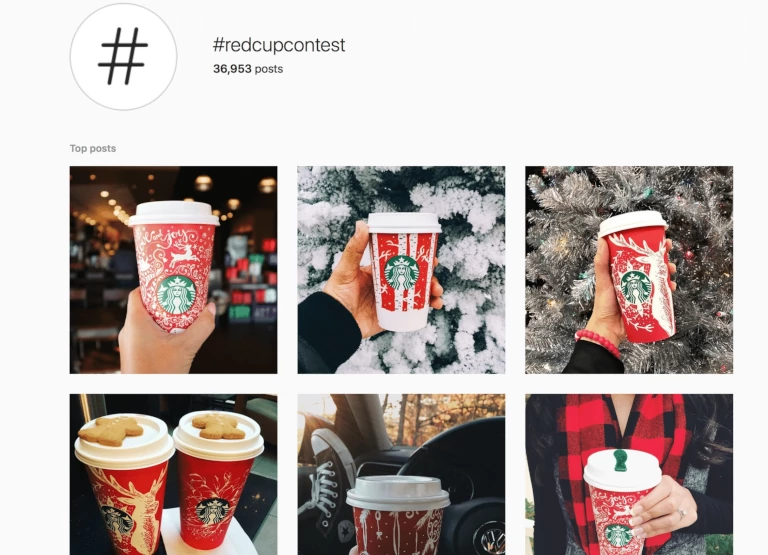

محتوایی که در اینستاگرام با دیگران به اشتراک می‌گذارید، چه در قالب عکس و چه در قالب ویدیو، ممکن است آنقدر گیرا باشد که مخاطب را برای چند لحظه روی پست شما میخکوب کند، اما آنچه از نظر بازاریابی و فروش اهمیت بسیار بالایی دارد و مخاطب رابه انجام اقدامی مجاب می‌کند، درواقع کپشنی فکر‌شده، اصولی و خلاقانه است.

کپشن‌نویسی در اینستاگرام به شما فرصت جذب فالوورهای بیشتر را می‌دهد و استفاده از کپشن‌های متقاعد‌کننده مشارکت بیشتری را به‌همراه دارد، همین مشارکت بیشتر، نکته‌ای کلیدی در الگوریتم اینستاگرام برای بیشتر دیده شدن است.

رعایت اصول کپشن‌‌نویسی حرفه‌ای در اینستاگرام می‌تواند افزایش ترافیک وب‌سایت، افزایش فالوورها در اینستاگرام و درنهایت افزایش فروش محصول را برای کسب‌وکار شما به ارمغان آورد. در ادامه با ما همراه باشید تا با اصول کپشن‌‌نویسی حرفه‌ای در این پلتفرم بیشتر آشنا شوید.

## کپشن خوب
کپشن‌ها در شبکه‌ی اجتماعی [اینستاگرام](https://www.instagram.com/) نوعی محتوای متنی هستند که با به‌خرج دادن کمی خلاقیت و رعایت برخی اصول، به‌راحتی میزان تعامل دیگر افراد را با پیج شما افزایش می‌دهند.

کپشن‌های جذاب می‌توانند نرخ تعامل پیج شما را بالا ببرند و داستان و شخصیت برند شما را شکل دهند. کپشن خوب، کپشنی است که مخاطب با خواندن آن احساس کند به آنچه می‌فروشید نیاز دارد. در ساده‌ترین شکل، کپشن خوب اینستاگرامی زمینه‌ی فروش بیشتر را فراهم می‌کند، به پیج شما شخصیت می‌بخشد و ضمن آموزش نامحسوس به فالوورها، آن‌ها را به خرید (یا هر انجام اقدامی متناسب با محتوای پیج شما) تشویق می‌کند.

علاوه‌بر‌این در الگوریتم جدید اینستاگرام، اگر میزان تعامل مخاطبان با پیج شما بتواند توجه این پلتفرم را جلب کند، فارغ از تعداد فالوورهایی که دارید، پست‌های پیج شما را بیشتر به افراد نمایش می‌دهد. پس داشتن تعداد بالای فالوور، دیگر تضمینی برای دیده شدن محتوایی که به‌اشتراک می‌گذارید نخواهد بود. اینستاگرام اوایل سال جاری، نحوه‌ی عملکرد الگوریتم خود را این‌گونه توضیح داد:

> آنچه در فید به شما نشان داده می‌شود، به پست‌ها و حساب‌هایی که بیشتر با آن‌ها ارتباط برقرار کرده‌اید، بستگی دارد، البته عوامل دیگری مانند زمان انتشار محتوا و تعداد دفعات بازدید هم مؤثر خواهند بود.

## کپشن اینستاگرام و اهداف کمپین

قبل از اینکه وارد بحث اصول کپشن نویسی اینستاگرام شویم، کمی درباره‌ی اهداف اصلی استراتژی‌های مختلف در اینستاگرام (طراحی کمپین برای بالا بردن تعامل) صحبت کنیم. اهداف کلی تمام این استراتژی‌ها عبارتند از:

- ایجاد آگاهی برای افزایش دیده شدن پیج و به طور کلی افزایش آگاهی از برندی که تولید کرده‌اید. (این افزایش دیده شدن می‌تواند به معنای افزایش چک کردن پیج شما و افزایش تعداد فالوورها باشد یا ترافیک بیشتری را به وب‌سایت شما هدایت کند)
- آگاهی‌رسانی در مورد فروش، حراج‌ها، عرضه‌ و معرفی محصول یا مجموعه‌ای جدید از محصولات
- راهکاری برای محتوای تولید شده توسط کاربران با هشتگ‌هایی که شما خلق کرده‌اید؛ برای مثال استارباکس در سال ۲۰۱۵ هشتگی (RedCupContest#) را خلق و اعلام کرد از میان کاربرانی که عکس لیوان‌های قهوه‌‌ی این کافه با این هشتگ منتشر کنند، به تعدادی به قید قرعه گیفت کارت‌های ارزشمندی هدیه می‌دهد. این هشتگ هوشمندانه باعث شد تا در عرض چند ماه کاربران بسیاری عکس کاپ‌های استارباکس را در پیج خود منتشر کرده و به بیشتر دیده شدن این برند کمک کنند.

همچنین اگر اکانت اینستاگرامی شما از نوع بیزنسی باشد، می‌توانید روی پست‌های حمایت‌شده (Sponsored) هم سرمایه‌گذاری کنید تا محتوایی که به اشتراک می‌گذارید، برای مخاطبان هدف شما هم نمایش داده شود. این پست‌های حمایت شده در قبال هزینه‌ای که می‌پردازید، امکانات کال تو اکشن متنوعی مانند تماس با ما، بیشتر بدانید، همین حالا رزرو کنید یا گزینه‌ی دانلود فراهم می‌کنند.

با‌اینحال اگر قصد طراحی کمپینی کاملاً ارگانیک و بدون سرمایه‌گذاری در تبلیغات را دارید، باید دو هدف اصلی را مد نظر داشته باشید:

- تشویق فالوورها و فالوورهای بالقوه برای خواندن کپشن، هدایت آن‌ها به پروفایل اینستاگرام و کلیک روی لینک موجود در بیو.
- مجاب کردن فالوورها به لایک کردن، نظر دادن یا اشتراک‌گذاری (با تگ کردن دیگران)

به یاد داشته باشید که شما نمی‌توانید لینک‌های قابل کلیک در پست‌های ارگانیک قرار دهید و باید به نحوی کاربران را از طریق لینک موجود در بیو اینستاگرام و به وب‌سایت یا صفحه‌ی محصول خود هدایت کنید.

### چگونه مانند حرفه‌ای‌ها کپشن اینستاگرام بنویسیم

یک کپشن حرفه‌ای می‌تواند علاوه‌بر جان بخشیدن به محصول و برند شما، مخاطب را هم سرگرم کرده و را برای انجام کاری متقاعد کند. تعداد کاراکتر‌های مجاز برای نوشتن کپشن‌ها ۲۲۰۰ کاراکتر و تعداد هشتگ مجاز هم در کپشن ۳۰ عدد است؛ انتخاب هشتگ مناسب و پربازدید، بازدید پیج شما را افزایش می‌دهد، علاوه‌براین شما می‌توانید برای جذابیت کپشن‌ها از ایموجی‌ها هم کمک بگیرید.

البته این موضوع به این معنی نیست که همه‌ی کپشن‌ها حتما باید هشتگ یا ایموجی داشته باشد. این‌ها تنها ابزاری برای جلب توجه مخاطبان، خوانده شده کپشن‌ها و تبدیل مخاطبان  به فالوور هستند.

#### از جمله‌ی اول نهایت استفاده را ببرید

اینستاگرام تنها چند عبارت اول هر کپشن را در نگاه اول به مخاطب نشان می‌دهد و باقی آن را پس از سه نقطه در قالب کلمه‌ی "more" پنهان می‌کند، پس بهتر است تا مهمترین جزئیات را در ابتدای کپشن قرار دهید.

> کلمات اول هر کپشن، نقش بازاریابی در رسانه‌های دیگر را بازی می کنند

کاربران هنگام چک کردن اینستاگرام فقط اولین جمله از کپشن را می بینند، پس این جمله یا باید آنچنان قانع‌کننده باشد که کاربر برای خواندن ادامه‌ی آن روی more کلیک کند یا با مطرح کردن سوالی کاربر را برای پاسخ دادن به ادامه‌ی کپشن یا حتی بیو هدایت کند.

#### کال تو اکشن اضافه کنید یا سوال بپرسید

هر پست باید هدف و نیتی داشته باشد، پس بهتر است هرکدام را با هدفِ همان پست هدایت کرده و منتظر نتیجه بمانید. انتظار دارید فالوور‌ها کدامیک از فعالیت‌های زیر را انجام دهند؟

بازدید از وب‌سایت؟ خرید محصولی خاص؟ به‌اشتراک‌گذاری پست با دوستان؟ خرید اشتراک؟ شرکت در مسابقه؟ استفاده از هشتگی خاص در پست خود؟ (آخری راهی عالی برای جمع‌آوری محتوای تولید شده توسط کاربر است.)

هدف اصلی هر کپشن باید تشویق به مشارکت برای بالا بردن تعامل مخاطب باشد. الگوریتم اینستاگرام این افزایش تعامل را به عنوان معیاری برای نمایش بیشتر دیگر پست‌های شما به مخاطبان در نظر می‌گیرد. عبارت‌های زیر برخی مثال‌های کال تو اکشن هستند که می‌توانید در کپشن خود از آن‌ها استفاده کنید:

- روی لینک این محصول/خبر/اشتراک/مسابقه تو بیو کلیک کنید.
- نظرتون رو درمورد این محصول/خبر/اشتراک/مسابقه تو کامنتا بنویسید.
- هرکی که این محصول/خبر/اشتراک/مسابقه رو دوست داره، منشن کنید. (تاکتیکی عالی برای افزایش تعامل افرادی که شما را فالوو نمی‌کنند.)
- یه عکس با این هشتگِ ما رو تو پیج خودتون پست کنید و جایزه بگیرید.

#### محتوای با‌ارزش اضافه کنید

نکات و ترفندها یا در کل هر نوع اطلاعاتی برای آموزش یا اطلاع‌رسانی (و البته در راستای فعالیت‌تان)، می‌تواند ارزش افزوده‌ای برای پست اینستاگرامی شما محسوب شود. ارائه‌ی محتوای با ارزش در کپشن‌های اینستاگرام برای کاربران جالب است و احتمال به‌اشتراک‌گذاری و ذخیره‌ی پست را بیشتر می‌کند.

#### همانطور که صحبت می‌کنید، بنویسید

احساس راحتی یکی از مهم‌ترین عواملی است که باعث می‌شود تا مخاطب به شما اعتماد کند. سعی کنید در محتوا و کپشن‌های، فیلم بازی نکنید، ربات‌گونه ننویسید، خودِ واقعی‌تان باشید و همانطور که صحبت می‌کنید، بنویسید.

> کپشن‌های خوب اینستاگرام رباتیک به نظر نمی‌رسند

می‌توانید همزمان استراتژی‌های خود را پیش ببرید و هدفمند باشید، اما در عین‌حال هم با کاربر، عامیانه و مانند یک دوست روبرو شوید.

#### کپشن‌ها را ابتدا در پلتفرم دیگری بنویسید

اگر قبل از چکش‌کاری نهایی، کپشن‌های خود را در پلتفرم دیگری بنویسید، احتمالاً استراتژیک‌تر و بدون حواس‌پرتی فکر می‌کنید.

اگر هنگام نوشتن کپشن اینستاگرام برای کسب‌وکار، فکرهای خود را در فضایی خارج از موبایل (روی کامپیوتر یا کاغذ) بنویسیم، نتیجه خلاقانه‌تر و هوشمندانه‌تر خواهد بود. دسکتاپ یا کاغذ امکان ویرایش ساده‌تری را فراهم می‌کنند و راحت‌تر می‌توانید هنگام نوشتن اهداف بازاریابی خود را دنبال کنید.

به یاد داشته باشید، هنگام نوشتن متن کپشن، اهداف کمپین را به‌عنوان هسته‌ی اصلی نوشته، حفظ کنید و همیشه چند ایده‌ی جایگزین هم داشته باشید، چرا که اولین کلماتی که به ذهن‌تان می‌آیند، لزوماً بهترین گزینه نیستند و همیشه جا برای خلاقیت بیشتر هست.

#### از هنر داستان‌سرایی بهره ببرید

کپشن خنثی، جذاب نیست. اضافه کردن شخصیت و کمی چاشنی به کپشن‌ها به آن‌ها روح می‌دهد. شما با نوشتن دو تا سه کلمه، عبارت یا حکایت می‌توانید تصویری را در دهن خواننده ترسیم کنید که با پست شما ارتباط بیشتری برقرار کند. اگر قصد فروش عروسکی را در پستی دارید، برای آن نام انتخاب کنید، اگر محصول شما دستور‌پخت یا غذایی در منوی رستوران‌تان است، با عباراتی مانند نمکی یا آتشین مزه‌ی غذا را در ذهن خواننده تداعی کنید.

#### از ایموجی‌ها استفاده کنید

ایموجی‌ها می‌توانند حس و حال شاداب‌تری را برای کپشن‌ها ایجاد کنند. قرار دادن این شکلک‌ها در آخر کپشن مانند حسن‌ختامی برای نوشته‌های خسته‌های خسته‌کننده عمل می‌کنند، حتی می‌توانند راهی عالی برای هدایت خواننده به انجام عملی خاص، مانند کلیک روی لینک در بیو ارائه دهند.

#### استفاده از ایموجی در کپشن

به یاد داشته باشید، در استفاده از ایموجی زیاده‌روی نکنید و اگر قصد استفاده از این ابزار را در کپشن خود دارید، دقت کنید که ایموجیِ موردنظر با لحنِ نوشته و کسب‌و‌کار و برند شما همخوانی داشته باشد؛ برای این کار می‌توانید در ابتدای تعریف برند یا طراحی کمپین، مجموعه‌ای از ایموجی‌های مناسب را تعیین کنید و در ادامه تنها از همان شکلک‌ها استفاده کنید.

برخی از ایموجی‌ها نشان‌دهنده‌ی مفهومی آشنا برای مخاطب هستند، برای مثال 🔗 بهتر است به‌عنوان پیوند در بیو جایی که لینک وب‌سایت‌تان را می‌گذارید، استفاده شود یا📍،🎯، 📌 برای نشان دادن آدرس یا موقعیت به‌کار می‌روند.

#### کیفیت را به کمیت ترجیح دهید

در کپشن‌نویسی مانند بسیاری از استراتژی‌های بازاریابی، کیفیت از کمیت مهم‌تر است. فرقی نمی‌کند که کپشن شما طولانی یا خیلی خلاصه باشد، اگر جالب باشد یا ارزش افزوده‌‌ای دراختیار مخاطب قرار دهد، می‌تواند هدف شما را تأمین کند؛ با‌این‌حال اگر بین موجزنویسی یا نوشتن متنی طولانی شک دارید، بهتر است متن کوتاه‌تر را انتخاب کنید.

#### هشتگ‌ را فراموش نکنید

هشتگ‌های اینستاگرام راهی کلیدی برای جستجوی پست‌های شما هستند، بنابراین مطمئن شوید که از آن‌ها به درستی استفاده می‌کنید.

اگر به پست‌های برخی برندها نگاهی بیندازید، متوجه می‌شوید که هشتگ‌های مرتبط را در انتهای کپشن به نحوی (با ترتیبی خاص، به صورت عمودی، با فاصله‌ی زیاد از کپشن) گروه‌بندی می‌کنند تا فضایی جداگانه را به توضیحات کپشن اختصاص داده و زیبایی کپشن را از بین نبرند.

بهتر است هشتگ‌هایی که استفاده می‌کنید، ترکیبی از امضای برند، کسب‌و‌کار یا افراد مرتبط، محصولات مشابه و سایر هشتگ‌های پرطرفدار مرتبط باشند. به هشتگ‌هایی که رقبایتان استفاده می‌کنند هم دقت کنید.

## نکات و ترفندهای کپشن اینستاگرام

تا اینجا اصول کپشن‌نویسی حرفه‌ای اینستاگرام را معرفی کردیم، اما قبل از شروع به نوشتن این محتوای ارزشمند بهتر است برای برخی نکات و ترفند‌ها را نیز بدانید.

### اضافه کردن فضای خالی در کپشن

ساده‌ترین و سریع‌ترین راه برای افزودن فضای خالی یا سفید در کپشن‌های اینستاگرام، استفاده از نمادهایی مانند ۰ یا - است. این فضای خالی می‌تواند به زیبایی ظاهری کپشن و مرتب بودن آن کمک کند.

### استفاده از کامنت برای کپشن طولانی‌تر (کاراکتر یا هشتگ‌های بیشتر)

همانطور که گفتیم، کپشن پست‌های اینستاگرام حداکثر می‌تواند ۲٬۲۰۰ کاراکتر و ۳۰ هشتگ باشد. برای نوشتن کپشنی طولانی‌تر از کامنت استفاده کنید.

### داشتن چک لیستی برای کپشن نهایی

قبل از نهایی‌کردن کپشن، سؤالات زیر را از خود بپرسید:

- آیا این کپشن آموزنده است؟ آیا اطلاعات یا جزئیات مناسبی در مورد محصول، یا کسب‌و‌کار شما ارائه می‌دهد؟
- آیا این کپشن نشان‌دهنده‌ی لحن و سبک برند شما است؟ آیا کاربر می‌تواند از لحن و سبک کلی آن، حدس بزند که این کپشن به شما تعلق دارد؟
- آیا این کپشن شما مخاطب را به انجام کاری تشویق می‌کند؟ آیا این کال تو اکشن به اندازه‌ی کافی برای مخاطب واضح است؟
- آیا این کپشن زیبا است؟ آیا هشتگ‌ها یا ایموجی‌ها مخاطب را گیج می‌کنند؟
- آیا این کپشن ارزش افزوده‌ای در اختیار مخاطب قرار می‌دهد؟ آیا مخاطب با خواندن این کپشن اطلاعات جدید یا فرصتی برای ارتباط با سایر فالوورها خواهد داشت؟ بهتر است تا به جای تعداد بسیار زیادی پست‌، تعدادی کمتر اما با محتوایی ارزشمند‌تر به‌‌اشتراک بگذارید.

## نکته‌ی پایانی

برندسازی در هویت محصول و پیج شما، کلمات و لحنی مشخص را به شما دیکته می‌کند. از آنجایی که نمی‌توانید از هم کلمه و هر لحنی استفاده کنید، طبیعتاً نمی‌توانید دل تمام مخاطبان اینستاگرام را نیز به‌دست آورید. برندسازی شما احتمالاً برخی را جذب و برخی را هم دفع می‌کند. بهتر است تنها روی مشتریان بالقوه‌ و نحوه‌ی جذب آن‌ها تمرکز داشته باشید و ایده‌آل‌گرا نباشید.

### سوالات متداول

#### کپشن ایده‌آل از چند کاراکتر تشکیل شده است؟

طول کپشن ایده‌‌آل بسته به هدف، می‌تواند متفاوت باشد. اگر با یک پاراگراف، هدف شما محقق می‌شود، کپشنی کوتاه کافی است و دیگر به نوشتن متن‌های طولانی نیازی ندازید. اما برخی پست‌ها نیاز به کپشن‌های طولانی‌تری دارند؛ درهر‌حال درنظر داشته باشید معمولا مخاطبان اینستاگرام تمایلی به مطالعه متن‌های طولانی نداشته و اغلب اولویت با متن‌های کوتاه است.

#### نوشتن کپشن اینستاگرام چه محدودیت‌هایی دارد؟

کپشن اینستاگرام دو محدودیت اصلی دارد. اولین محدودیت استفاده از حداکثر ۲۲۰۰ کاراکتر و دومین محدودیت آن استفاده از حداکثر ۳۰ هشتگ است.

