## دانلود قالب وودمارت

توجه: ما نسخه اصلی را ارائه می دهیم و فقط فایل های ترجمه، راستچین و فونت فارسی را به قالب اضافه کرده ایم و برخلاف اکثر سایت های دیگر که قالب را قفل و لایسنس گذاری کرده اند، هیچ دستکاری در قالب انجام نداده ایم.

- [دانلود نسخه  7.0.2 از کانال تلگرام](https://t.me/wp_content_free/5)

**اگر نیاز به بهینه سازی یا شخصی سازی قالب وودمارت داشتید [با ما تماس بگیرید](/fa/about/#%D8%AA%D9%85%D8%A7%D8%B3-%D8%A8%D8%A7-%D9%85%D9%86).**

**مشاهده لیست تغییرات قالب از لینک زیر:**

```
https://xtemos.com/woodmart-changelog.php
```

قالب WoodMart یک قالب پریمیوم وردپرس  قدرت گرفته از فناوری AJAX است که با هدف ساخت و راه اندازی سایت های فروشگاهی آنلاین با یک رابط کاربری زیبا و حرفه ای طراحی و بهینه سازی شده است.

مهم نیست که شما قصد راه اندازی فروشگاه آنلاین در چه زمینه ای دارید، قالب وودمارت برای این کار از صفر تا صد طراحی شده و بهترین امکانات را در اختیار شما قرار خواهد داد.

قالب WoodMart به دلیل کدنویسی سبک و بهینه و در کنار آن امکانات بسیار زیادی که در اختیار کاربرانش قرار می‌دهد از محبوبیت بسیار بالایی برخوردار است.


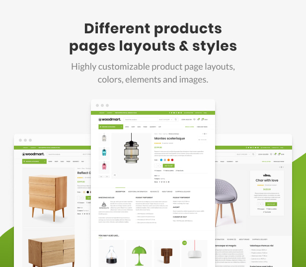

برای طراحی سایت فروشگاهی‌تان نیاز به خرید یا نصب افزونه‌های اضافی ندارید. لیست علاقه‌مندی‌ها، مقایسه، متغیرهای محصول، فیلتر های ایجکس و... در این قالب شما را از نصب حداقل ۱۰ تا ۲۰ افزونه اضافی نجات می‌دهد.

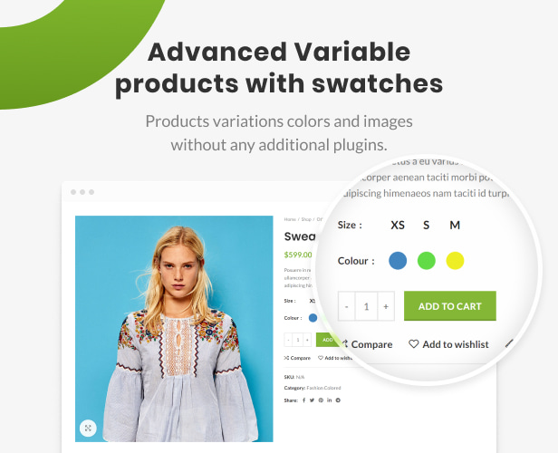


## برخی از ویژگی های مهم قالب وودمارت

بعضی از ویژگی ها برای طراحان سایت و صاحبان فروشگاه اهمیت زیادی دارد. ، رسپانسیو بودن، سرعت، سئو و امکانات مواردی هستند که شاید در ظاهر ساده بنظر بیایند اما در نرخ تبدیل و تجربه کاربری بسیار تاثیر گذارند. در ادامه لیست این ویژگی ها بیان شده است.

- سازگار با المنتور و ویژوال کامپوزر
- کاملا راستچین و فارسی
- دارای فونت فارسی محبوب وزیر
- اسلایدر ریوولوشن
- مگا منو فوق حرفه ای
- پشتیبانی از هدر چسپنده
- هدر شفاف
- پشتیبانی از فوتر چسبنده
- فیلتر ایجکس فروشگاه
- جستجوگر ایجکس محصولات (جستجوی زنده)
- قالب سازگار با افزونه های چند فروشندگی
- صفحه حساب کاربری اختصاصی
- سربرگ ساز با امکان کشیدن و رها کردن المنت ها
- دارای استایل تیره قالب
- لیست علاقمندی ها و مقایسه محصول
- سازگار با افزونه چند زبانه کردن سایت WPML
- شخصی سازی حرفه ای سایدبار
- آیکون های سبد خرید مختلف
- نمای 360 درجه محصول
- تایمر شمارش معکوس برای فروش محصولات
- حالت کاتالوگ بدون نمایش قیمت
- امکان ورود به سایت با شبکه های اجتماعی
- و بسیاری امکانات دیگر …

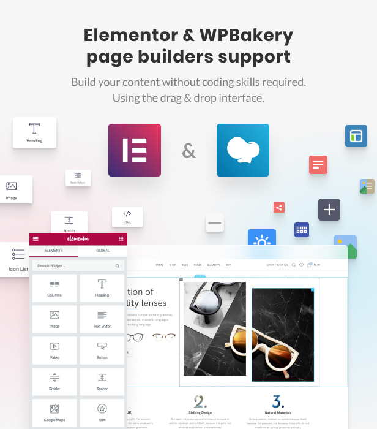

امکانات قالب وردپرس وودمارت همه نیاز های شما را فراهم می کند. هر نوع فروشگاه آنلاینی را که در ذهن خود تصور می کنید ، با قالب وودمارت می‌توانید ایجاد کنید و بر درآمد خود رو به روز بیافزایید.

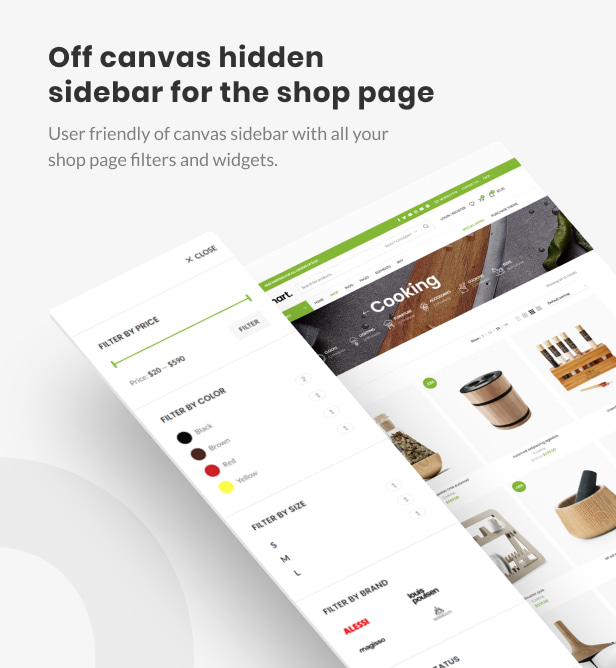


### پنل تنظیمات و فارسی قالب وودمارت

در پنل تنظیمات  قالب وودمارت می‌توانید به تغییر طیف وسیعی از تنظیمات قالب فقط با یک کلیک بپردازید، شما نه نیاز به دانش برنامه نویسی و نه پلاگین های متعدد دارید.

تمام مواردی که برای طراحی سایت فروشگاهی لازم بوده است برای شما در این قالب وردپرس گنجانده شده است. از این جهت به آسانی می‌توانید هر تغییر دلخواهی در قالب فروشگاهی خود اعمال کنید.

### طراحی هدر با دراگ و دراپ

در قالب وردپرس WoodMart به راحتی هدر سایت خود را در محیط دراگ و دراپ مانند صفحه ساز بسازید. این یکی از  ویژگی‌های عالی قالب وودمارت است.

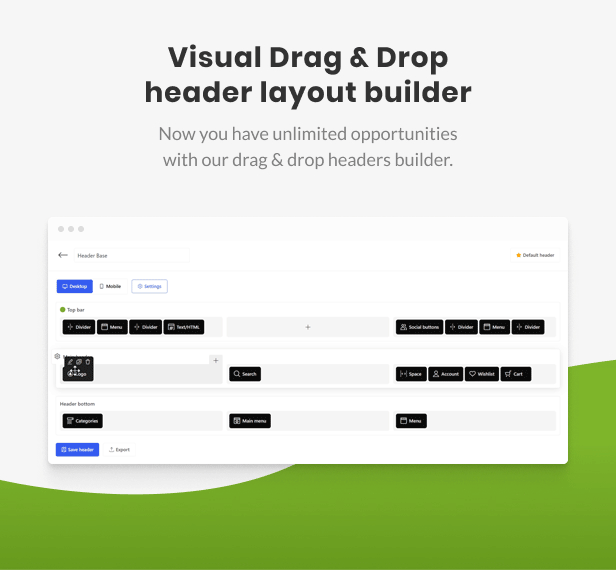

در تصویر بالا همان طور که مشاهده می کنید المنت های متفاوت و زیادی را در اختیار دارید و  علاوه براین، هر کدام از این المنت ها دارای تنظیمات خودشان هستند. حتی می توانید آن ها را هم شخصی سازی کنید یا آیکون ها را تغییر دهید. در آخر می توانید آن ها را تنها یا یک کشیدن و رها کردن در جای موردنظرتان در سایت تان نمایش دهید.

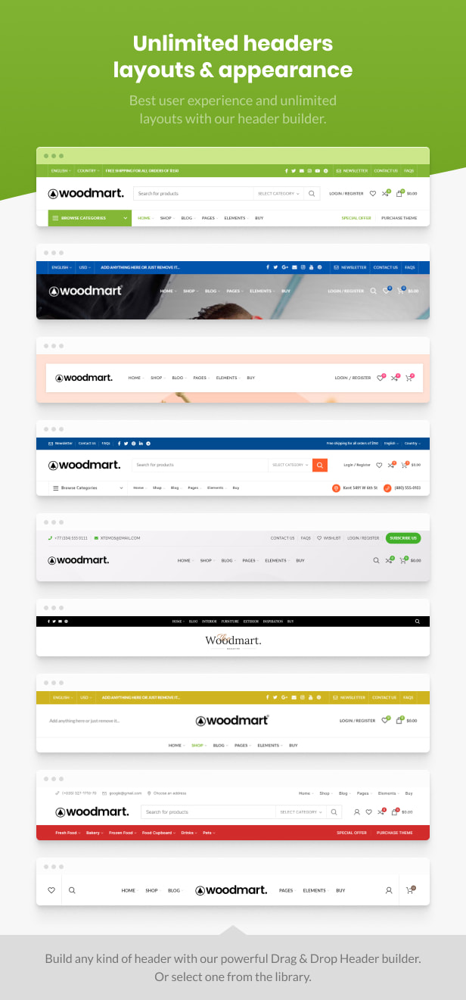

علاوه بر این با این قالب میتوانید مگا منو های پیشرفته با ظاهری زیبا طراحی کنید.


### سرعت عالی و کدنویسی بهینه

سرعت و کدهای استاندارد  وب سایت از مهم ترین ویژگی های رتبه بندی گوگل از سال 2021 می باشد. با انتخاب قالب وودمارت نیازی نیست با کندی وب سایت وردپرس خود بجنگید.

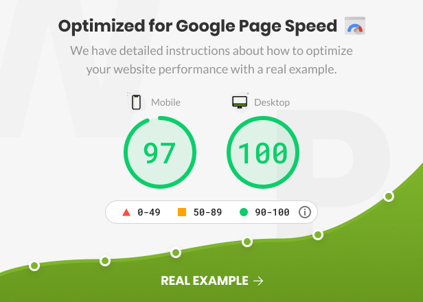


### بهینه سازی شده برای سئو

سئو در حال حاضر از مهم ترین مسئله‌ای است که تمامی سایت ها درگیر آن هستند و تمام تلاش خود را به کار گرفته‌اند تا بهترین نتیجه را بگیرند. قالب woodmart به سایت شما کمک می کند که در گوگل، بینگ، یاهو و… امتیاز بالایی دریافت کند.


قالب وودمارت علاوه بر طراحی بسیار زیبایی که دارد با تمامی افزونه های سئو سازگار است بنابراین شما می توانید استراتژی هایی را که برای سئو و بهینه سازی سایت تان مد نظر دارید را به راحتی پیاده کنید.


### ساخت اسلایدرهای زیبا و حرفه ای

قالب WoodMart با افزونه روولوشن اسلایدر به طور کامل سازگار است و حتی اسلایدرهای دموهایش را هم با همین افزونه حرفه ای طراحی کرده است. شما هم می توانید برای ساخت اسلایدر سایت تان از این افزونه که آن هم به صورت رایگان در همین سایت موجود است کمک بگیرد.


اگر مایل به استفاده از افزونه رولوشن اسلایدر نیستید؛ قالب وودمارت به کمک شما می آید و شما می توانید با المنت های صفحه ساز این قالب اسلایدر های مورد نظرتان را طراحی کنید. کار با این المنت ها بسیار ساده است و حتی اگر فردی تازه کار هستید می توانید به راحتی اسلایدرهای مختلف را با استفاده از المنتور در مدت زمانی کوتاه طراحی کنید.

### نسخه موبایل

در قالب وودمارت می توان نسخه موبایل صفحات را به صورت جداگانه طراحی کرد. یعنی شما برای هر صفحه ای از وب سایت خود می توانید یک نسخه مخصوص دسکتاپ و یک نسخه مخصوص دستگاه های موبایل و تبلت را داشته باشید.


### سیستم حرفه ای و زیبای عضویت و ورود قالب وودمارت

 قالب  WoodMart دارای یک سیستم حرفه ای و زیبای عضویت و ورود به سایت است که به صورت داخلی طراحی شده و شما را از نصب هرگونه افزونه اضافی بی نیاز می کند.

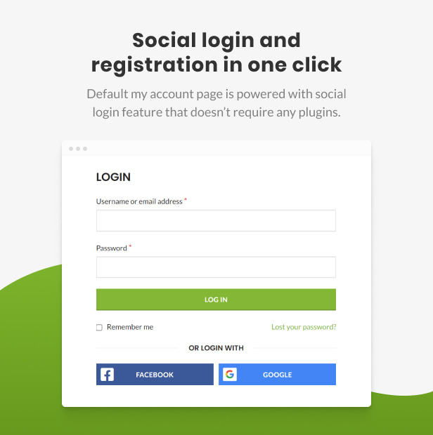


### چند فروشندگی

برای اجرای یک مارکت‌پلیس می توانید روی قالب WoodMart حساب کنید. قالب وودمارت با افزونه دکان کاملا هماهنگ بوده و می توانید به سادگی سایت فروشگاهی خود را آماده عضویت فروشندگان مختلف کنید.

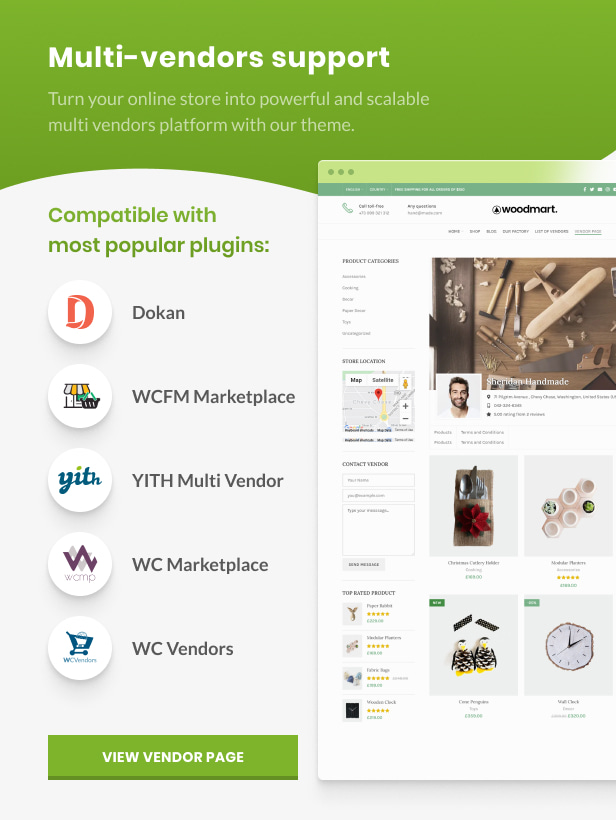


### بروزرسانی رایگان

برای آپدیت قالب نیاز نیست نگران چیزی باشید! فقط کافی است در کانال تلگرام ما عضو شوید و ما به محض انتشار جدیدترین نسخه، آن را رایگان منتشر می‌کنیم. دسترسی به آپدیت های قالب مادام العمر و کاملا رایگان می باشد.

### جستجوگر ایجکس محصولات (جستجوی زنده)

با قابلیت جستجوی زنده ایجکس قالب ووکامرس WoodMart به کاربران این اجازه را می دهد که بتوانند هم زمان با نوشتن نام محصول مورد نظرشان، محصولات مرتبط را به صورت زنده و در همان لحظه مشاهده و  انتخاب کنند.


در تصویر بالا با نوشتن کلمه موبایل، محصولاتی که مربوط به این کلمه هستند نمایش داده شده و مشتری می تواند از بین آن ها محصول مورد نظرش را انتخاب کند.

### سیستم داخلی مقایسه محصولات

برای مقایسه محصولات تان نیازی به افزونه اضافی ندارید. در تنظیمات قالب وودمارت میتوانید قابلیت مقایسه محصولات را فعال کرده و این امکان را در اختیار کاربران تان قرار دهید.


کاربران شما هم در صفحه فروشگاه و محصول دسترسی به این قابلیت دارند. با کلیک بر روی دکمه مقایسه، محصول مورد نظر شخص به لیست مقایسه اضافه می‌شود.

### تضمین اورجینال بودن

تهیه قالب ووکامرس از یک منبع مورد اعتماد یکی از دغدغه‌های وبمستران است. قالب وودمارت به صورت مستقیم از طراح اصلی آن در تم فارست خریداری شده است. ما آن را به صورت کاملا اورجینال و تضمین شده به شما ارائه می‌کنیم. با خیال آسوده نصب کنید!

### پشتیبانی قالب وودمارت

ما اینجا تنها قالب وودمارت را بدون محدودیت با فونت فارسی برای دانلود به صورت رایگان در اختیارتان قرار دادیم. در صورت نیاز به پشتیبانی با پرداخت هزینه مشکل شما را رفع میکنیم.

### سازگاری قالب وودمارت


افزونه های مهمی که قالب WoodMart از آن‌ها پشتیبانی می‌کند را در ادامه لیست کردیم؛

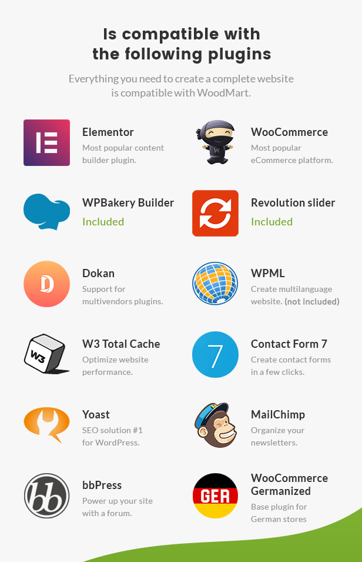


### بیش از ۷۰ دمو و ۳۷۰ المنت از پیش طراحی شده

با قالب WoodMart به بیش از ۷۰ دمو جذاب و خیره کننده اصلی دسترسی دارید که برای طراحی هر نوع سایت فروشگاهی اعم از مد و لباس، مبلمان، لوازم الکترونیکی، ساعت، کفش، جواهرات یا لوازم آرایش می‌توانید استفاده کنید.

[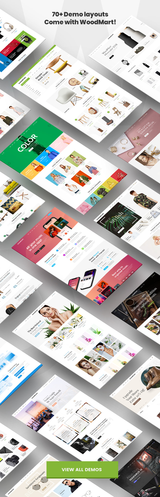](https://woodmart.xtemos.com/)

این قالب برای سایت های شرکتی و مجلات نیز مناسب است و می‌توانید بدون افزونه ووکامرس از آن استفاده کنید.

**سایت های زنده ایی که با قالب وودمارت  طراحی سایت‌ شدند:**


<p style="direction:ltr;">
<a href="https://muzano.com.pe/" rel="nofollow">https://muzano.com.pe/</a>    |    
<a href="https://specialistec.com/" rel="nofollow">https://specialistec.com/</a>    |    
<a href="https://www.simplygreentrade.com/" rel="nofollow">https://www.simplygreentrade.com/</a>    |    
<a href="https://happease.me/formulas/jungle-spirit/" rel="nofollow">https://happease.me/</a>    |    
<a href="https://vapegirl.nl" rel="nofollow">https://vapegirl.nl</a>    |    
<a href="https://www.lavitasarim.com/" rel="nofollow">https://www.lavitasarim.com/</a>    |    
<a href="https://mrbig.gr/" rel="nofollow">https://mrbig.gr/</a>    |    
<a href="https://spanelskavesnice.cz/" rel="nofollow">https://spanelskavesnice.cz/</a>    |    
<a href="https://www.meinetanne.de/" rel="nofollow">https://www.meinetanne.de/</a>    |    
<a href="https://www.mamitis.es/" rel="nofollow">https://www.mamitis.es/</a>    |    
<a href="https://www.twelvebeauty.com/" rel="nofollow">https://www.twelvebeauty.com/</a>    |    
<a href="https://eltocadordevictoria.es/" rel="nofollow">https://eltocadordevictoria.es/</a>    |    
<a href="https://www.vthemp.com/" rel="nofollow">https://www.vthemp.com/</a> | 
<a href="https://www.antivirus-webshop.nl/" rel="nofollow">https://www.antivirus-webshop.nl/</a> | 
<a href="https://demleniyor.com/" rel="nofollow">https://demleniyor.com/</a> | 
<a href="https://ekaanimumbai.com/" rel="nofollow">https://ekaanimumbai.com/</a> | 
<a href="https://www.spendways.com/fr/" rel="nofollow">https://www.spendways.com/fr/</a> | 
<a href="https://www.batteriesandsolar.co.uk/" rel="nofollow">https://www.batteriesandsolar.co.uk/</a> | 
<a href="https://roasthead.com" rel="nofollow">https://roasthead.com</a> | 
<a href="https://toptankahveler.com" rel="nofollow">https://toptankahveler.com</a> | 
<a href="https://meltemevinceramic.com" rel="nofollow">https://meltemevinceramic.com</a> | 
<a href="https://demetyildirim.com" rel="nofollow">https://demetyildirim.com</a> | 
<a href="https://casida.com/" rel="nofollow">https://casida.com/</a> | 
<a href="https://minekeskin.com" rel="nofollow">https://minekeskin.com</a> | 
<a href="https://drkalko.com" rel="nofollow">https://drkalko.com/</a>
</p>

*لطفاً توجه داشته باشید که همه نمونه‌ها سایت‌های زنده هستند که توسط مشتریان با استفاده از تم WoodMart توسعه داده شده‌اند (آنها توسط XTemos توسعه داده نشده‌اند). و برخی از آنها با سفارشی سازی سایت‌شان را ساخته‌اند، بنابراین وب سایت شما بدون شخصی‌سازی نمی تواند دقیقاً مانند برخی از نمونه های بالا به نظر برسد.*

